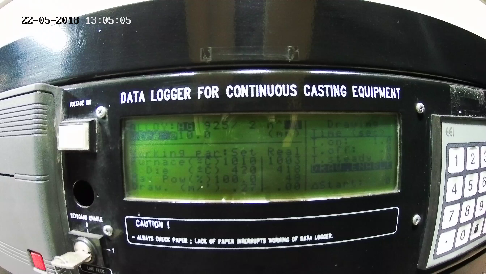

# METALLURG
 
Распознавание панелей приборов производственного оборудования.

### Navigation
- [Requirements](#requirements)
- [Presets](#presets)
- [Installing](#installing)
- [Running](#running)
- [Example](#example)

### Requirements
- `Python 3`
- `ffmpeg`

### Presets
- устанавливаем **ffmpeg** `sudo apt-get install ffmpeg` (**Linux only**)
- устанавливаем зависимости для **python3** `pip3 install -r requirements.txt`

### Installing
Заходим в файл `config.ini` и указываем имена файлов для видео и для csv-результата

### Running
Запускаем в консоли `python3 main.py`

### Example
Кадр из видео:

**console output** and **result.csv**:
```
22-05-2018 13:05:05,1003,418,0.00
22-05-2018 13:05:06,1003,418,0.00
22-05-2018 13:05:07,1003,418,0.00
22-05-2018 13:05:08,1003,418,0.00
22-05-2018 13:05:09,1003,419,0.00
22-05-2018 13:05:10,1003,419,0.25
22-05-2018 13:05:11,1004,420,0.25
22-05-2018 13:05:12,1004,420,0.25
22-05-2018 13:05:13,1004,420,0.25
22-05-2018 13:05:14,1004,421,0.25
22-05-2018 13:05:15,1004,421,0.25
22-05-2018 13:05:16,1005,421,0.25
22-05-2018 13:05:17,1005,421,0.25
22-05-2018 13:05:18,1004,422,0.25
22-05-2018 13:05:19,1005,422,0.25
22-05-2018 13:05:20,1005,422,0.25
22-05-2018 13:05:21,1005,422,0.25
22-05-2018 13:05:22,1005,423,0.25
22-05-2018 13:05:23,1006,423,0.25
22-05-2018 13:05:24,1006,423,0.25
...
```